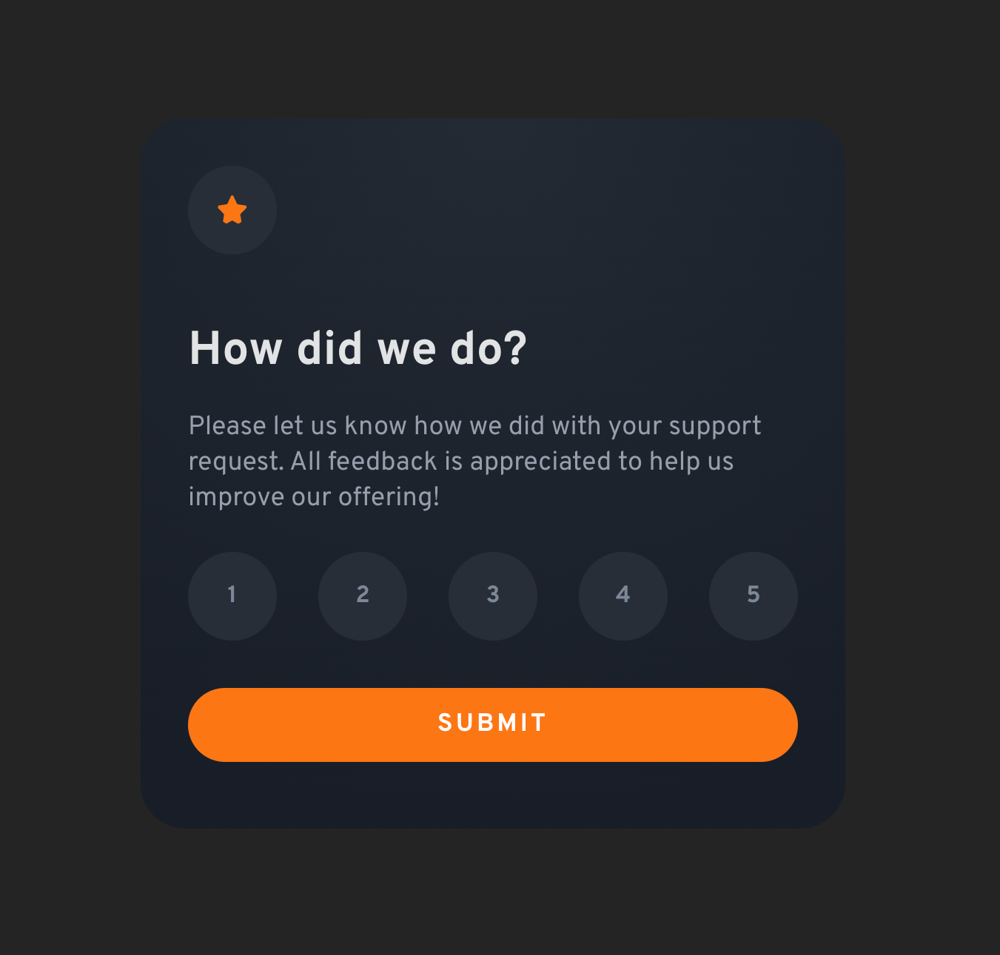

# Frontend Mentor - Interactive rating component solution

This is a solution to the [Interactive rating component challenge on Frontend Mentor](https://www.frontendmentor.io/challenges/interactive-rating-component-koxpeBUmI). Frontend Mentor challenges help you improve your coding skills by building realistic projects.

## Overview

### The challenge

Users should be able to:

- View the optimal layout for the app depending on their device's screen size
- See hover states for all interactive elements on the page
- Select and submit a number rating
- See the "Thank you" card state after submitting a rating

## Screenshot

## Links

- [Frontend Mentor Solution](https://www.frontendmentor.io/solutions/interactive-rating-component-using-vite-react-app-and-css-modules-tj41Qn7ORm)
- [Live Site](https://classy-cat-7632e7.netlify.app/)

## Built with

- [Vite](https://vitejs.dev/) - Build tool
- [React](https://reactjs.org/) - JS library
- [CSS Modules](https://github.com/css-modules/css-modules) - For styles
